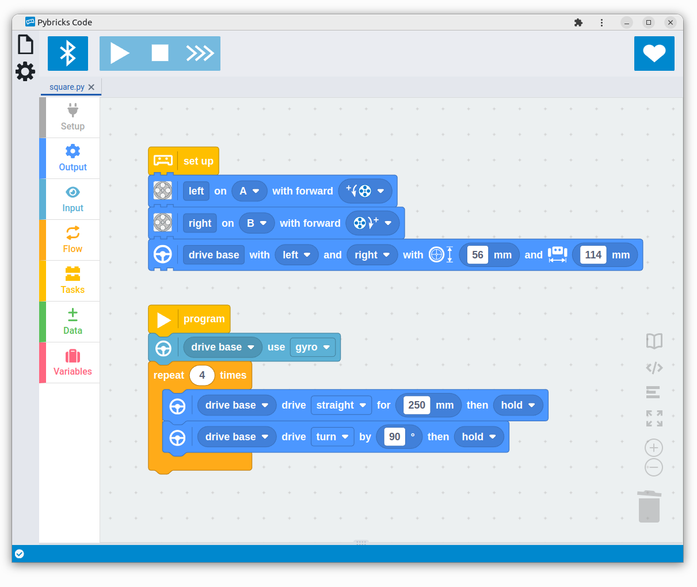

- *For the first time ever, fans of all LEGO themes can bring their smart bricks
  together in a single app for endless possibilities and creativity.*
- *Make your LEGO City trains, LEGO BOOST creatures, LEGO Technic machines, or
  SPIKE and MINDSTORMS robots come alive. All with the same code blocks!*
- *Programs are saved directly onto the LEGO hubs. Just press the button and go.
  No permanent connections required.*
- *Hubs communicate wirelessly so you can build at every scale.*
- *Accurate vehicle control using built-in gyro for robot missions.*
- *Smooth transition from blocks to Python with live preview.*
- *Low floors and high ceilings: Easy to get started, but endless possibilities
  by mixing blocks with Python.*
- *Exclusively available to Pybricks supporters on Patreon.*

***November 28th, 2023 - Pybricks Headquarters***:
Today, the Pybricks team presents the first beta release of block coding for
all modern LEGO® hubs. For the first time, fans of all LEGO themes can bring
their smart bricks together in a single app for endless possibilities and
creativity.

Whether you want to make smart train layouts, autonomous Technic machines,
interactive BOOST creatures, or super-precise SPIKE and MINDSTORMS robots, you
can do it with Pybricks.

Pybricks is beginner-friendly and easy to use. There’s no need to install
complicated apps or libraries either. Just go to
[https://code.pybricks.com](https://code.pybricks.com), update the firmware,
and start coding.

And now for the first time, no prior Python coding experience is required. You
can code with familiar but powerful blocks, and gradually switch to
Python when you're ready. The live preview makes it easy to see how your
blocks translate to Python code.

Meanwhile, more seasoned builders and robotics teams will enjoy advanced
features such as color sensor calibration or builtin gyro control for drive
bases.

The new block coding experience is exclusively available to our supporters on
[Patreon](https://www.patreon.com/pybricks). You can sign up for a monthly
subscription or make a one-time pledge in our
[shop](https://www.patreon.com/pybricks/shop) for lifetime access.

Python coding remains entirely free and open source, and continues to be
supported by a community of developers and LEGO enthusiasts around the world.
Improvements are made almost every day, with the lead developers actively
engaging with the community for ideas, bug fixes, and brand new features. 

So grab your LEGO sets and [start coding](https://code.pybricks.com)!

## Features and insights

*Get live Python code preview.*

*A dedicated setup
section helps you keep big projects organized. Enter robot dimensions for
 accurate navigation using the gyro.*

*Multitasking is easy with dedicated blocks.*

*Use all motors, and sensors. If the cable fits, it just works.*

*Easily access documentation for all blocks.*

*Choose between blocks and Python, or even use them together!*

## Example projects

Block projects run on any hub, including the LEGO BOOST Move Hub. This project
showcases the Boost Autobuilder project.

This project also shows how brand new features, like
looping over a list, can make big programs much easier to follow. It also helps
you gradually explore common coding patterns before jumping into Python.

And it's saved directly on the hub, so you can take it anywhere!

<iframe width="560" height="315" src="https://www.youtube-nocookie.com/embed/TXvCEK1MNGQ" title="YouTube video player" frameborder="0" allow="accelerometer; autoplay; clipboard-write; encrypted-media; gyroscope; picture-in-picture" allowfullscreen></iframe>

-----

All of the following projects can now be made with block coding!

-----
*Smart autonomous trains*



-----
*Technic hub with train remote*



-----
*Hub to hub communication*



-----
*Use all moden LEGO hubs together, just like bricks of all ages!*



-----
*Automatic Roller Coaster*



-----
*Programs are saved on the hub, and you can use the buttons*



## Contact

For more information, please contact [team@pybricks.com](mailto:team@pybricks.com)
