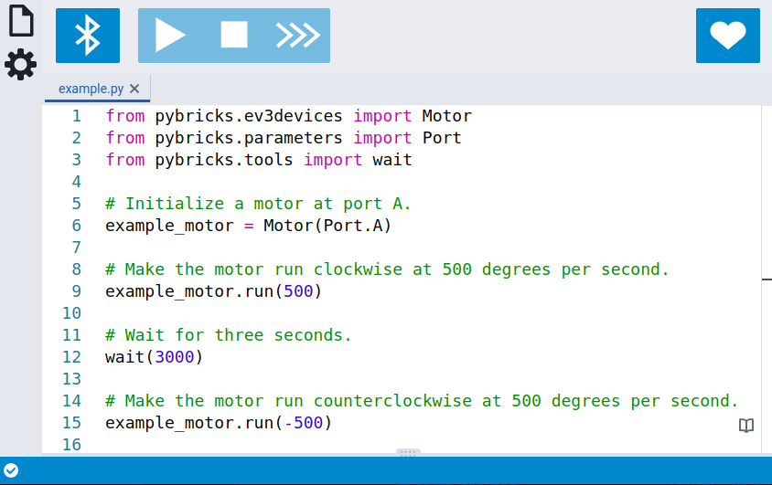

If your LEGO set works with a Bluetooth app, chances are it works
with Pybricks too. Click on a hub below for instructions.

## Powered Up

All modern battery-powered LEGO sets use *Powered Up* technology. This includes
programmable hubs, motors, and sensors, which all feature the *same connector*.

Pybricks can be installed by upgrading the firmware on the hub. The
instructions differ per hub, as shown below. Once installed, they all work
the same way.

### Pybricks Code

[{:width="75%"}](/install/pybricks-code)

[Pybricks Code] is the app used for programming Powered Up hubs using Pybricks.
[Click to learn more!](/install/pybricks-code).

[Pybricks Code]: https://code.pybricks.com

### Technic / BOOST / City

[{:width="75%"}](/install/technic-boost-city)

These hubs come in some Technic, BOOST, Train, and City sets. They share the
same installation method.
[Click to get started!](/install/technic-boost-city)

You can save at most one program on these hubs. There's still plenty you can do
with them, though!

Out of the box, these hubs can be controlled using mobile phone apps. With
Pybricks, the script runs on the hub itself, which is about 100x faster. This
makes a huge difference when using motors or sensors. Now you can detect colors
on a train track or follow lines without skipping a beat!

### SPIKE / MINDSTORMS

These hubs come in the LEGO Education SPIKE Prime set and the LEGO MINDSTORMS
Robot Inventor sets.
[Click to get started!](/install/spike-mindstorms)

These hubs are a bit more powerful than the other Powered Up hubs shown above.
They have more
ports, lights, and buttons. They also have a rechargeable battery and a
built-in speaker.

Out of the box, these hubs can already be programmed with MicroPython. But with
Pybricks, your code runs much faster, and you'll have about three times as much
memory. All Powered Up motors and sensors have easy-to-use classes, and they're
more accurate too. More exciting features are on the way as well!

### Running programs

Once you've installed Pybricks firmware on any of the hubs above, you're ready
to start coding. [Click to get started!](/install/running-programs)

## MINDSTORMS EV3

[{:width="50%"}](/install/mindstorms-ev3/installation)

Pybricks also continues to support LEGO MINDSTORMS EV3.

Instead of the online editor used for the newer hubs, you'll use Visual Studio
Code to write your programs.
[Click to get started!](/install/mindstorms-ev3/installation)
