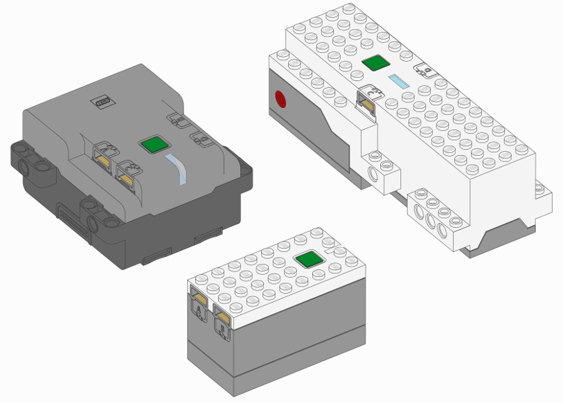
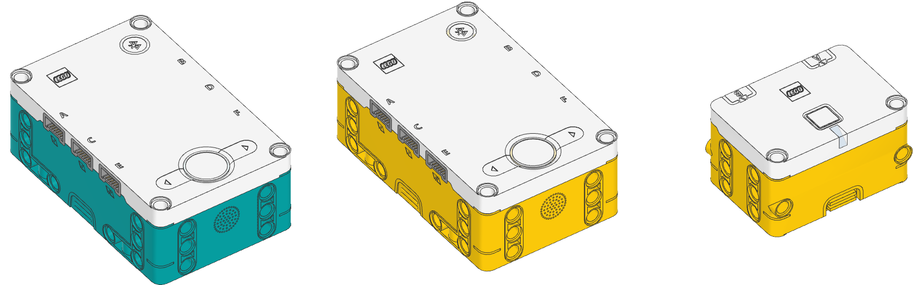
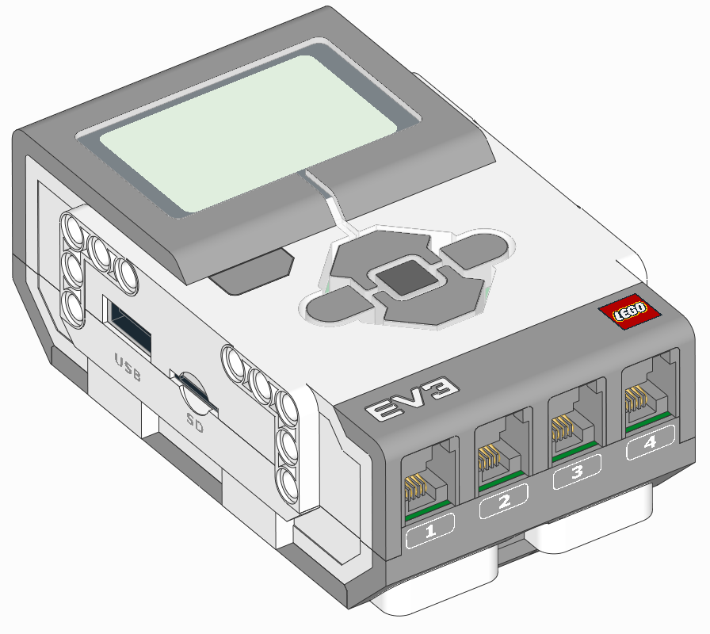

If your LEGO set works with a Bluetooth app, chances are it works
with Pybricks too.

## Technic / BOOST / City / SPIKE / MINDSTORMS

All modern battery-powered LEGO sets use *Powered Up* technology. This includes
programmable hubs, motors, and sensors, which all feature the *same connector*.

Pybricks can be installed by upgrading the firmware on the hub. Once installed,
they all work the same way.

[{:width="75%"}](/learn/getting-started/install-pybricks/)

## MINDSTORMS EV3

[{:width="50%"}](/install/mindstorms-ev3/installation)

Pybricks also continues to support LEGO MINDSTORMS EV3.

Instead of the online editor used for the newer hubs, you'll use Visual Studio
Code to write your programs.
[Click to get started!](/install/mindstorms-ev3/installation)

For EV3, Pybricks supports only MicroPython coding, not block-based coding.
