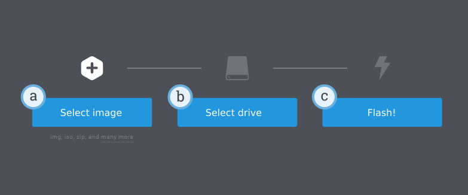

This page guides you through the steps to collect and install everything you
need to start programming the EV3. Use the menu on the left to navigate the
instructions for [using the EV3 brick](/install/mindstorms-ev3/using-the-brick/)
and to [run programs](/install/mindstorms-ev3/running-programs/).

**Note** ⸺ Pybricks for MINDSTORMS EV3 uses Pybricks version 2.0, while newer
hubs like SPIKE, Technic, and MINDSTORMS Inventor use Pybricks 3.0 or higher.
This means you can only code your EV3 with MicroPython in Visual Studio Code.
The simpler [online interface](https://code.pybricks.com/) with block-based
coding is not available for EV3. If you would like to see continued EV3
support, including block-based coding in our web app, please let us know on
[our forum](https://github.com/orgs/pybricks/discussions). If we can find
enough teachers and developers who want to get involved, perhaps we can make
this happen.
{: .notice--warning}

## What do you need?

To get started, you'll need:

- A Windows 10 or Mac OS computer.
- During installation: Internet and administrator access.
- A microSD card: You'll need a card with a minimum capacity of 4GB and a maximum capacity
    of 32GB. This type of microSD card is also known as microSDHC. We recommend
    cards with Application Performance Class A1.
- A microSD card slot or microSD card reader.
- A mini-USB cable, like the one included with your EV3 set.

The typical configuration of this equipment is shown below:

## Preparing your computer

You'll write your MicroPython programs using Visual Studio Code. Follow the
steps below to download and install it:

1. Download [Visual Studio Code](https://code.visualstudio.com/Download).
2. Follow the on-screen instructions to install it.
3. Launch Visual Studio Code.
4. Open the extensions tab.
5. Install the EV3 MicroPython extension as shown below.

## Preparing the microSD card

Next, you'll install the required tools on your microSD card.

If the microSD card contains files you want to keep, make sure to create a
backup of its contents first.
Click [here](/install/mindstorms-ev3/running-programs#managing-files-on-the-ev3-brick)
to learn how to backup your
previous MicroPython programs if necessary.

*This process erases everything on your microSD card, including any previous
MicroPython programs on it.*

To install the MicroPython tools on your microSD card:

1. Download the [EV3 MicroPython microSD card image](https://education.lego.com/en-us/product-resources/mindstorms-ev3/teacher-resources/python-for-ev3)
   and save it in a convenient location. This file is approximately 360 MB.
   You do **not** need to unzip the file.
2. Download and install a microSD card flashing tool
   such as [Etcher](https://www.balena.io/etcher/).
3. Insert the microSD card into your computer or card reader.
4. Launch the flashing tool and follow the steps on your screen to install
   the file you have just downloaded. If you use Etcher, you can follow the
   instructions below, as shown below:
   
   1. Select the EV3 MicroPython microSD card image file you have just
      downloaded.
   2. Select your microSD card. Make sure that the device and size
      correspond to your microSD card.
   3. Start the flashing process. This may take several minutes. Do not
      remove the card until the flashing process is complete.

## Updating the microSD card

To update the microSD card, download a new image file using the link above and
flash it to the microSD card as described above. Be sure
to [back up any MicroPython programs you want to save](/install/mindstorms-ev3/running-programs#managing-files-on-the-ev3-brick).

You do not need to erase the contents of the microSD card first. This is done
automatically when you flash the new image file.
